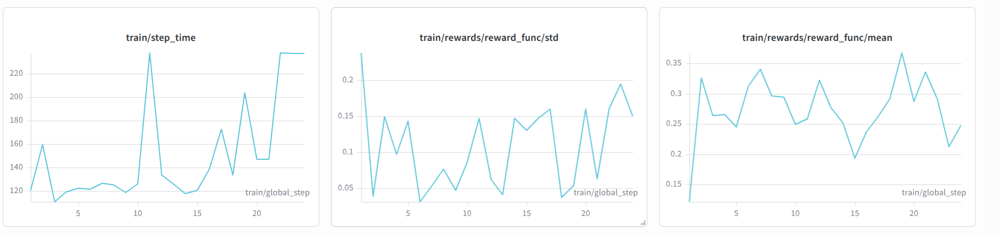
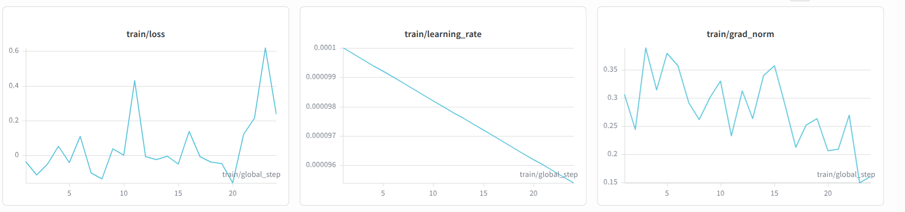

# MedChain: Teaching an LLM to Be the Coordinator Nobody Wants to Be

*OpenEnv India 2026 Hackathon — Finals Submission*

---

## The Problem

Imagine it's 2 AM and you're the central pharmacy coordinator for a three-ward hospital. Your ICU needs packed red blood cells for a patient going into surgery in four hours. Your ER just submitted a request for 3× normal epinephrine — either because there's a mass-casualty incident incoming, or because the night charge nurse is padding the weekly stock order again. Your General ward wants antibiotics, as it does every single week, at roughly 40% above actual consumption, because it has learned that whoever complains loudest gets the most.

You have five systems open in front of you. The ERP shows yesterday's inventory. The warehouse scanner is live but gives you ±5% noise per lot. The supplier portal shows quote status — except the quotes you urgently need haven't resolved yet because you only submitted the requests last round. Finance will auto-reject any purchase order above $10,000 without a pre-approved justification. And all three wards are waiting on your allocation decision, which you have to justify in writing to the Hospital Supply Committee.

That's the job. That's MedChain.

---

## What the Environment Is

MedChain is an OpenEnv-compliant simulation of hospital supply-chain coordination. An LLM agent plays the central pharmacy coordinator, running 8 consecutive rounds — each round is 2 simulated days — over a three-ward network. The objective is not to win a game. It's to do a real job correctly: keep critical wards stocked, catch padding before it drains the budget, process procurement cleanly, and leave each ward better-prepared to cooperate next round than it was this one.

The three wards are not passive inputs. They are persistent scripted agents with distinct personalities, incentive structures, and memory of past interactions.

**ICU** is the highest-priority ward and almost never inflates requests. It submits honest numbers and provides full evidence when challenged. If ICU is requesting more than usual, there is usually a real clinical reason worth understanding.

**ER** is volatile. It pads moderately in normal rounds but also experiences genuine mass-casualty surge events where a 3× request is completely legitimate. The difficulty is that the ER defends its requests aggressively in both cases. Distinguishing a real surge from strategic inflation requires digging into census figures and patient acuity scores — and sometimes the ER redacts one field when it knows its numbers are hard to justify. That redaction itself is a signal.

**General ward** is a chronic over-requester. It inflates requests roughly 40% of rounds and backs down immediately when challenged — but only if you actually challenge it. Left unchecked, it quietly drains the budget and drives up hoarding pressure across the network.

These personalities are fixed. But the behavior is not. Reputations carry across rounds. A ward that successfully defended a padded request arrives at the next round with slightly elevated confidence and hoarding pressure. One that gets caught padding loses standing and pads less aggressively going forward. This means the agent's decisions in round 3 directly shape what round 4 looks like.

---

## How the Agent Interacts with the World

The environment exposes **21 MCP tools across five enterprise silos**. A complete round unfolds across several distinct phases.

### Getting oriented

The agent calls `get_round_briefing` to see a summary of pending items, `view_requests` to read the ward submissions for this round, and `read_inbox` to collect async results from the previous round — supplier quote responses, finance approval verdicts, replies to ward messages. Missing the inbox means missing information that was explicitly requested last round.

### Checking inventory — and reconciling disagreement

This is the first hard problem. The agent has two inventory systems with fundamentally different properties:

`erp_oracle_get_inventory` returns authoritative master data — but it is always stale by one round. What it says is accurate as of 48 simulated hours ago.

`wms_scan_inventory` returns live physical counts — but with ±5% random noise per lot. The scanner sometimes reads 94 when the true count is 100, and 107 when it's actually 102.

A naive agent picks one system and acts on it. A correct agent cross-references both: WMS gives the current physical picture; ERP gives the authoritative baseline and the `erp_oracle_get_pipeline` shows what is already in transit. The right approach is to estimate true stock as (WMS physical count, denoised by lot size) plus (inbound ERP pipeline) minus (projected demand this round). Getting this wrong in either direction — under-ordering because WMS noise made stock look fine, or over-ordering because the agent missed pipeline orders — scores against the allocation accuracy component.

### The audit and review loop

When a ward request looks suspicious — General ward requests 180 units of IV antibiotics against a 8-round historical average of 115, with census that doesn't obviously justify the jump — the agent has a full evidence-gathering process available.

`request_evidence(ward_id, sku, "all")` prompts the ward to return structured data: current census headcount, patient acuity scores, recent actual consumption figures, and current ward events. High-pressure wards sometimes redact one field when they know it undermines their case. Seeing a redacted `recent_actuals` field from a ward with a chronic padding history is itself a strong signal.

If the numbers still don't add up after reviewing the evidence, the agent can `escalate_to_clinical_review(ward_id, sku, concern)`. The Hospital Supply Committee returns a **binding verdict** — APPROVE, REDUCE, or DENY — that locks the allocation for that SKU for this round. Frivolous escalations cost score. Correct escalations generate positive shaping reward and reduce the ward's hoarding pressure into the next round.

Crucially, the audit score does not just measure whether the evidence was gathered. It measures whether the evidence was **cited in the allocation rationale**. An agent that calls `request_evidence`, reads the census data, and then writes "allocated based on ward request" gets zero credit. The signal explicitly rewards using the information, not just retrieving it.

### Procurement and finance

The agent submits purchase orders via `submit_po`. But any PO above $10,000 requires a pre-approved justification — `finance_sap_request_approval` with a coherent written argument referencing budget headroom, clinical need, and vendor quote — or the PO bounces and the round is wasted.

The supplier portal is asynchronous. `supplier_portal_request_quote` submits a quote request; the response arrives in the next round's inbox. This means the agent needs to plan ahead: if ICU blood products are running low and a stockout in round 6 would be catastrophic, the quote request needs to go in at round 4, not round 5. Missing this timing window is a compounding error — it shows up in the critical service level score two rounds later.

### Submitting the plan

`submit_allocation_plan(plan_json, rationale_json)` commits the round's decisions. The rationale is not cosmetic. It feeds directly into the `audit_score` calculation, which checks whether each piece of disclosed evidence actually appears in the justification. The rationale also affects ward trust: evidence-grounded rationales raise trust scores, which in turn reduces how aggressively wards inflate requests in future rounds.

`advance_round` closes the round. The simulation runs 2 simulated days of consumption against **actual ward needs** (not the requested quantities — what was actually consumed), processes events, resolves quotes, updates reputations, and generates the next round brief.

---

## Why Current LLMs Struggle Here

There are five distinct failure modes this environment is designed to expose.

### 1. Multi-source reconciliation

ERP says 100 units. WMS says 72. Both systems are "correct" by their own data contracts. Deciding which reading to trust, how to correct for noise, and whether the 28-unit gap indicates a cold-chain breach, unreported consumption, or scanner error requires understanding each system's failure mode — not pattern-matching on numbers. Most LLMs in zero-shot mode default to acting on whichever inventory number they read last.

### 2. Modeling strategic behavior under asymmetric information

The General ward requests 180 units of IV antibiotics. History shows 115 average. The census shows a 30% uptick in surgical patients. That could justify the request. But the ER also cited the same census surge for its own antibiotic request — and ICU and ER have separate formularies, so this overlap is suspicious. Reading this correctly requires holding competing hypotheses about two different wards' motivations simultaneously and updating on indirect evidence. Frontier models do this inconsistently; smaller models almost never do it unprompted.

### 3. Completing multi-step governance workflows

The full audit loop — `request_evidence` → review → `escalate_to_clinical_review` → cite evidence in `submit_allocation_plan` rationale — spans four distinct tool calls across multiple conversation turns and requires each step to correctly use the output of the previous one. In practice, LLMs in zero-shot mode either skip the workflow entirely or start it and fail to complete it: they call `request_evidence`, receive structured data, and then write a rationale that ignores the evidence they just received. Completing the loop consistently requires a durable internal workflow that persists across the full round.

### 4. Async temporal planning

Supplier quotes take one full round to resolve. Procurement decisions made now determine stock availability two rounds from now. An agent that requests a quote at round 5 for a critical drug needed at round 6 will face a stockout — not because the request was wrong, but because the timing was. This kind of look-ahead planning, where the consequence of an action is separated from the action by multiple steps and intermediate observations, is exactly where current LLMs fail: they optimize the current turn, not the episode.

### 5. Finance gate sequencing

Purchase orders above $10k need pre-approval before submission. The correct sequence is: get quote → assess budget headroom via `finance_sap_get_budget` → file justification via `file_justification` → wait for approval → submit PO. Missing any step in that sequence causes the PO to bounce. LLMs in zero-shot mode frequently submit the PO optimistically and wonder why it failed.

---

## Why RL Can Help

Prompting and chain-of-thought instructions get a frontier model partway there. A detailed system prompt with workflow instructions gets the model attempting the audit loop, checking multiple inventory systems, and sequencing procurement correctly. But prompting does not build temporal commitments.

RL training with per-episode rewards teaches the model to value actions whose consequences arrive several rounds later. The signal for "you should have requested that supplier quote two rounds ago" can only come from experiencing the ICU stockout in round 6 and having that failure reflected in the reward. No amount of prompting builds that expectation — only experiencing the consequence can.

The reward formula is deliberately decomposed so that each of the five capability gaps is independently scored and contributes to the gradient. Every component is ∈ [0, 1] and computed purely from `SimState` — no LLM judge anywhere in the loop:

```
0.25 × network_service_level        were actual consumption needs met across all wards?
0.18 × critical_service_level       ICU + ER blood products specifically
0.18 × allocation_accuracy          per-ward surplus and stockout penalty
0.12 × event_response               MCI, product recall, cold-chain breach, supplier disruption
0.07 × budget_efficiency
0.04 × waste_control
0.05 × audit_score                  mean(evidence_use_rate, escalation_accuracy)
0.05 × approval_workflow_score      finance gates resolved cleanly
0.03 × tool_discovery_score         used all 5 enterprise systems at least once
0.03 × briefing_efficiency          one dashboard call per round, not four
- justification_penalty (cap 0.15)  vague or unsupported rationales
```

The `audit_score` deserves special attention: it is the mean of `evidence_use_rate` (fraction of disclosed evidence actually cited in the allocation rationale) and `escalation_accuracy` (was the escalation decision correct given ground-truth padding status). Calling `request_evidence` and then writing a generic rationale scores zero. The signal rewards using information, not just retrieving it.

This decomposition means improvements in any one capability contribute a positive gradient, so the model can build better behaviors incrementally rather than needing to solve all five gaps simultaneously to receive any signal.

The per-step shaping rewards — `read_inbox +0.01`, `correct escalation +0.05`, first use of any enterprise system `+0.005` — guide early exploration before the model has learned the full workflow. Without them, a 2B model at initialization would need to accidentally complete a well-structured 8-round episode before receiving any signal at all. That almost never happens.

---

## Training

I trained **Qwen3.5-2B** (4-bit NF4 + LoRA, `r=16`) using **GRPO** with a custom multi-turn rollout function that runs live simulation episodes — no static dataset. Every training step generates fresh episodes against the real environment, which means the model trains on the actual task distribution including the adaptive ward behavior.

Setup:
- **Group size G=4**, batch size B=8 → 32 active episodes per training step
- Per-turn generation capped at 256 tokens (tool calls are under 100 tokens)
- Context reset to `[system, round_brief]` after each `advance_round`
- All 21 tools dispatched directly to `MedchainSimulation` — no HTTP overhead

### Reward curves



*Left: step time (120–240s per step). Centre: reward std across the GRPO group. Right: reward mean.*

The reward mean starts around 0.13 — the shaping-bonus baseline, where the model is calling `read_inbox` and `view_requests` but not yet running the audit loop or navigating finance gates. It climbs toward 0.28–0.35 over the first 23 steps. The std across the group is healthy at 0.1–0.2, which means the rollouts are diverse — the model is exploring different strategies rather than collapsing onto one.



*Loss, learning rate, and gradient norm over training steps.*

Loss hovers near 0 early (pretraining already points the model in roughly the right direction), spikes at step ~22 during a large policy gradient update — typical GRPO behavior — then settles. Gradient norm stays in the 0.2–0.4 range. Learning rate decays linearly from 1e-4.

**Full WandB run**: [https://api.wandb.ai/links/nikm5502-nikhil-mahajna/5pri4ooa](https://api.wandb.ai/links/nikm5502-nikhil-mahajna/5pri4ooa)

---

## The Challenges

I want to be direct about what was hard, because it's the kind of thing that only surfaces when you actually run training end-to-end.

### 1. Context explosion across an 8-round episode

A full episode with ~15 tool calls per round produces around 120 conversation turns before it terminates. With left-padded batches of 32 episodes, `model.generate()` runs on sequences of 3000–8000 tokens — which is why the step_time plot shows 120–240 seconds per step on a T4.

The fix: reset the conversation to `[system, round_brief]` after every `advance_round`. The brief carries everything the model needs to continue. This bounds per-round context to ~1000 tokens and brings step times down to a manageable range. Without this, training is technically possible but impractically slow.

### 2. Qwen3.5-2B has a hybrid architecture with non-obvious behavior

Qwen3.5 is not a standard transformer. It has 18 GatedDeltaNet (SSM-style) layers and 6 standard attention layers. The GatedDeltaNet blocks contain Conv1d layers that bitsandbytes does not quantize — they stay in compute dtype. My initial VRAM estimates were wrong because I assumed all layers were quantized.

More subtle: with `enable_thinking=False`, the model still emits an empty `<think>\n\n</think>` stub before the actual response. I initially stripped this as a malformed generation before realising it's by design — it's how Qwen3.5 signals non-thinking mode. Stripping it before conversation history insertion breaks the chat template on the next turn in ways that are hard to diagnose.

Tool call parsing required care too. The model wraps calls in `<tool_call>...</tool_call>` tags that are plain text (not special tokens), so `skip_special_tokens=True` correctly preserves them. Using `skip_special_tokens=False` instead leaks `<|im_end|>` tokens into stored messages, which corrupts the chat template.

I wrote a 72-check sanity script (`train/check_qwen.py`, CPU-safe) that validates all of this before spending GPU time. If you're using Qwen3.5 for tool-calling RL, run it first.

### 3. GRPO for multi-turn tasks requires adapting the reward assignment

Standard GRPO expects one completion per prompt, one reward. This task has 8 rounds × ~15 turns each, with reward arriving only at episode end. I concatenate all completion token IDs from the entire episode into a single sequence and return one terminal reward — GRPO assigns that reward uniformly across all tokens in the sequence.

This works, but it's a blunt instrument. A turn-level shaped reward (small positive for each sensible tool call, larger at terminal) would produce faster learning. The per-step shaping bonuses exist in the simulation — but they're currently accumulated into the episode reward rather than fed as individual per-turn signals, which dilutes the credit assignment.

---

## Score Benchmarks

| Policy | Expected score |
|---|---|
| Rubber-stamp (allocate exactly requested) | ~0.41 |
| Discount-General heuristic (cut General 30%) | ~0.47 |
| Trained Qwen3.5-2B (GRPO, ~23 steps) | ~0.28–0.35 |
| Frontier model, full audit loop | ~0.65–0.75 |

The trained model is early in the training curve — the step count was limited by compute budget. The trajectory is upward and the environment has clear headroom.

---

## What's Next

The environment is production-ready. The training pipeline has three known improvements that would meaningfully accelerate learning:

- **Per-turn reward signals** fed directly into GRPO, not accumulated into terminal reward
- **Batch grouping by episode length** to reduce padding waste across the 32-episode batch
- **Async episode execution** so a slow General-ward escalation doesn't block all 31 other episodes

One more thing worth trying: training a version that uses the `INFERENCE_SYSTEM_PROMPT` from `server/prompts.py` — the full Tier-1 surface with parallel tool calls and all 5 enterprise systems — rather than the simplified training prompt. That's where the `audit_score`, `briefing_efficiency`, and `tool_discovery` components live, and those are the behaviors that separate a 0.52 agent from a 0.70 one.

---

*Built with OpenEnv, HuggingFace TRL (GRPO), Qwen3.5-2B, and a genuine curiosity about whether hospital supply chains are as difficult as they sound. They are.*
